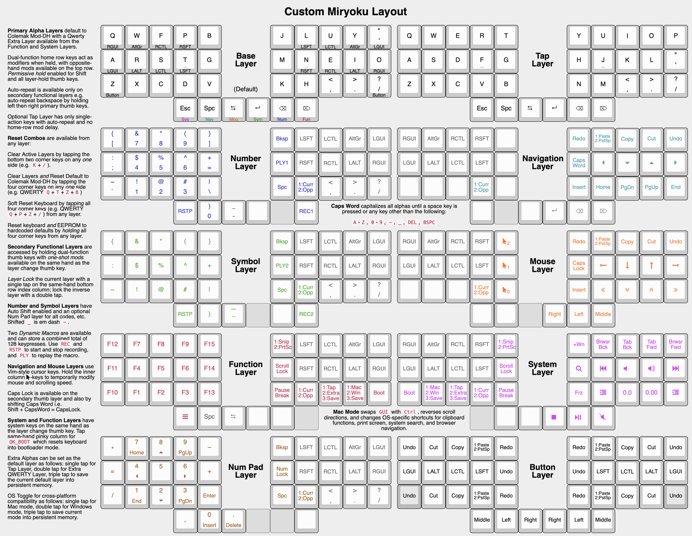

# PiousAeneas Custom Miryoku

A custom keyboard layout adapted heavily from Manna Harbour's [Miryoku](https://github.com/manna-harbour/miryoku) layout. Compile firmware by typing: `qmk compile -kb keyboardio/atreus -km PiousAeneas_miryoku`.

## Layers

### Base Layer

Base Layer alphas are [Colemak Mod-DH](https://colemakmods.github.io/mod-dh/).  `Comma`, `Dot`, and `Slash`, are included with the alphas, plus `Apostrophe` replacing `Semicolon`. Combine with `Shift` for `Less Than`, `Greater Than`, `Question Mark`, and `Quote`, as usual. The primary, secondary, and tertiary thumb keys are `Backspace`, `Enter`, and `Delete` on the right, and `Space`, `Tab`, and `Escape` on the left, respectively.

**Home Row Mods**: Tap for alpha, hold for modifier indicated in the lower front legend. Opposite-hand modifiers available on the top row. **Permissive Hold** is enabled for home-row shifts and thumb key layer tap-holds (i.e. `Sys`, `Nav`, `Mouse`, `Sym`, `Num`, `Fun`, `Button`) meaning the keys will immediately select the hold action when another key is tapped. Tapping term is extended by 50ms for pinky-key home row mods to prevent disruptive accidental triggering of e.g. `Win+R` and `Win+L`. 

### Primary Layers: Navigation & Number

**Navigation Layer**: The primary right-hand layer activated by holding the left home thumb key is for navigation and editing. Vim-style cursor keys are on the home position, line and page movement below, clipboard above, `Caps Word` and `Insert` on the inner column. Thumb keys are duplicated from the base layer to avoid having to layer change mid edit and to enable **auto-repeat**. `Caps Word` capitalizes all alphas until `Enter`, `Escape`, `Tab`, or `Space` is tapped or after the keyboard is idle for 5 seconds. Same-hand ring column used to toggle into Num Pad Layer while simultaneously turning on Num Lock. Pinky column used for basic `Num Lock` toggle.

**Number Layer**: The primary left-hand layer activated by holding the right home thumb key is for numerals and symbols. Numerals are in the standard numpad locations with symbols in the remaining positions. `Dot` is duplicated from the base layer. **Auto Shift** is enabled for numbers and symbols, simply hold the key to get its shifted state. Same-hand `Space`, `Dot`, and `Backslash` are duplicated from the Base Layer to minimize layer changes.

**For all primary, secondary, and tertiary layers**: One-shot mods for both hands mirrored from the Base Layer are available on the same hand as the layer change thumb key. Same-hand bottom-row index column key is used to toggle between Base Layer on single tap and Extra Layer on double tap. Same-hand bottom-row middle column is for **Layer Lock**: tap once to lock current layer, tap twice to lock the opposite hand's layer. Layer Lock works by setting the default layer that the keyboard returns to since standard layer toggles [can't be used](https://github.com/manna-harbour/miryoku/discussions/15) to lock the currently active momentary layer. Layer Lock can be unlocked by tapping the same-hand bottom-row index column, or by using the following combos on the active hand (i.e. right hand for Nav, Mouse, Sys; left hand for Num, Sym, Fun) which allows for full single-handed locking and unlocking:
- To return to Base Layer:  Combo bottom-row inner column + index column keys.
- To return to Extra Layer: Combo bottom-row inner column + index column + middle column keys.

### Secondary Layers: Mouse & Function

**Mouse Layer**: Secondary right-hand layer is for mouse emulation. Mouse movement mirrors cursor navigation on home row, and scroll wheel mirrors line and page movement below. Mouse buttons are on the thumbs. Left, right, and middle mouse buttons are on the primary, secondary, and tertiary thumb keys, respectively. Mouse movement, click, and drag, with modifiers, can be performed from the home position. Clipboard keys are duplicated from the Nav Layer. Mac Mode reverses scroll directions for compatibility with Natural Scrolling on trackpad. Hold keys on same-hand inner column to temporarily modify mouse and scroll speed.

**Symbol Layer**: Secondary left-hand layer has shifted symbols in the same locations as Num Layer to reduce chording when using mods with shifted symbols. `Open Parenthesis` is duplicated next to `Close Parenthesis` and `Em-Dash` replaces `Underscore`. Same-hand `Space`, `Dot`, and `Backslash` are duplicated from the Base Layer to minimize layer changes.

### Tertiary Layers: System & Function

**System Layer**: Tertiary right-hand layer is media control, browser navigation, system shortcuts, and Microsoft Excel. `Volume Up` / `Volume Down` and `Next` / `Prev` mirror the navigation keys. `Pause`, `Stop`, and `Mute` are on the primary, secondary, and tertiary thumbs, respectively. 

**Function Layer**: Tertiary left-hand layer has function keys mirroring the numerals on the primary layer with extras on the pinkie and inner columns. `App` Context Menu key is on the tertiary thumb key and other thumb keys are duplicated from the Base Layer to enable **auto-repeat**.

System keys are on the same-hand inner column: Double-tap `Snip` for `Print Screen`. **Mac Mode** toggle is on same-hand bottom-row ring column: tap once for Mac, tap twice to return to Windows default. Mac Mode swaps `GUI` with `Control`, changes OS-specific shortcuts, and reverses scroll directions. Tap Pinky column for `QK_BOOT` which resets keyboard into bootloader mode (Keyboardio Atreus requires you to simultaneously hold the bottom left key).

### Additional Layers: Extra, Button, & Num Pad

**Extra Layer**: The Extra Layer combines Miryoku's Extra and Tap Layers into a backup QWERTY layer where all alpha keys are single-action with no delay and auto-repeat enabled. This is useful for e.g. WASD navigation or applications where keystroke timing is important. Full-functionality is available by using one-shot mods accessed via thumb key layer taps.

**Button Layer**: Mouse buttons, mods, and clipboard keys for use with integrated or external pointing devices, used with either hand. Activated manually by holding a bottom row pinkie key.

**Num Pad Layer**: Toggle into Num Pad from Nav Layer for number pad keycode variants used in certain applications and for functionality such as alt codes. Num Lock turns on by default when toggling into this layer.