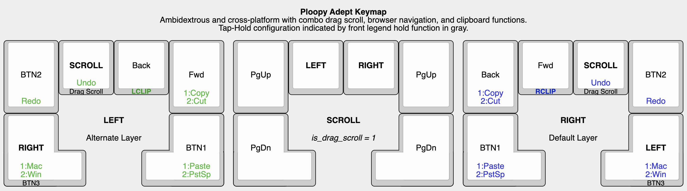

# PiousAeneas Custom Adept Keymap

Custom firmware for the Ploopy Adept. Meant for ambidextrous use with the mouse placed in the center of a split keyboard.

- Clipboard functions can be accessed by holding inner browser navigation key.
- Drag Scroll is converted into Combo Scroll. Tap to toggle on Drag Scroll and Scroll layer, hold to activate momentary Drag Scroll.
- Mac Mode converts browser navigation, clipboard functions, and scroll directions for use on macOS. 

Compile firmware by typing: `qmk compile -kb ploopyco/madromys/rev1_001 -km PiousAeneas`
