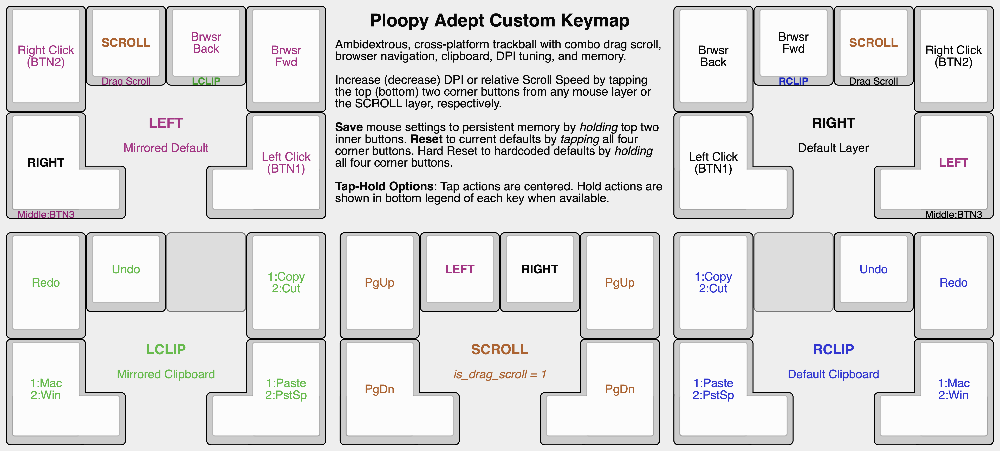

# PiousAeneas Custom Adept Keymap

Custom, cross-platform firmware for the Ploopy Adept designed for ambidextrous use — place the mouse between the halves of a split keyboard or on either side of a unibody keyboard.

## Core Features

- **Cross-Platform Support**: Mac Mode remaps clipboard shortcuts, browser navigation, and scroll direction for macOS compatibility. Toggle (Win) Mac Mode by (double) tapping the bottom outer button in the clipboard layer.
- **Built-in Clipboard**: Access clipboard functions (Copy, Cut, Paste, Paste w/o Formatting, Undo, Redo) by holding the inner browser navigation layer-tap key.
- **Combo Scrolling**: Default Drag Scroll is converted to Combo Scroll. Tap `COMBO_SCROLL` to toggle drag-scroll and Scroll Layer; hold to activate momentary drag-scroll.
- **Ambidextrous Compatibility**: Tap the bottom outer key to switch default handedness; hold for middle click.
- **DPI and Scroll Speed Tuning**: Adjust mouse DPI by combo tapping the top (bottom) two corner buttons to adjust DPI up (down). Adjust Scroll Speed relative to DPI by tapping the top (bottom) two corner buttons to increase (decrease) scroll speed relative to DPI.

## Save and Reset Settings

- **Save Settings**: Save DPI, Relative Scroll Speed, Handedness, and Mac Mode settings to persistent memory by holding the top two inner buttons from any layer.
- **Quick Reset**: Tap all four corner buttons from any layer to do a quick reset of DPI, Relative Scroll Speed, and Active Layers to current defaults. Mac Mode and default handedness upon reboot remain unchanged.
- **Hard Reset**: Hold all four corner buttons from any layer to do a hard reset of DPI, Relative Scroll Speed, Mac Mode, and Default Handedness back to the original hardcoded defaults i.e. right-handed Windows mode.

## Building and Flashing Firmware

- Compile firmware by typing: `qmk compile -kb ploopyco/madromys/rev1_001 -km PiousAeneas`
- To flash device, enter Bootloader mode by holding down the bottom left button while plugging in the device.